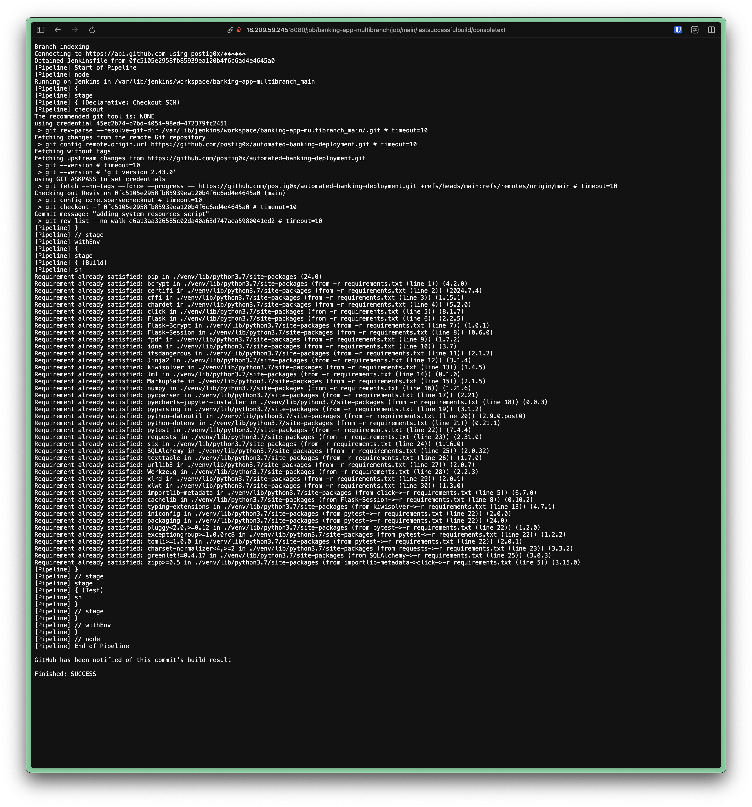
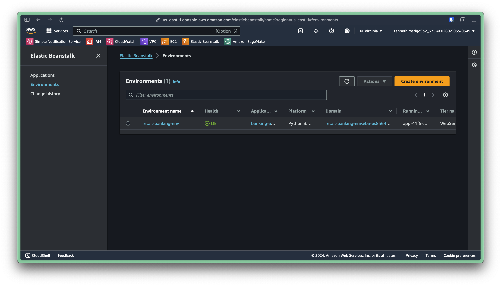
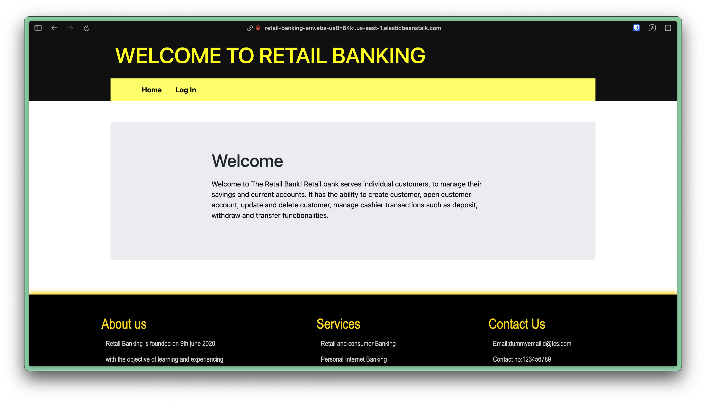

# Retail Banking Application

Fully managed retail banking application deployed with AWS.

## Overview

This repository contains the source code for a retail banking application that is deployed on AWS. The source code is built, tested, and deployed through Jenkins using AWS CLI and AWS EB CLI.

## Setup

First I created a new EC2 instance that will host the Jenkins server.  It is a `t2.micro` instance with mostly default settings, running Ubuntu and security group rules set for SSH (22), HTTP (80), and Jenkins (8080). Then, the instance is updated and upgraded with: `sudo apt update -y && sudo apt upgrade -y`

Jenkins is installed with a script:

```bash
#!/bin/bash
#~/scripts/jenkins_setup.sh

sudo apt update && sudo apt install fontconfig openjdk-17-jre software-properties-common && sudo add-apt-repository ppa:deadsnakes/ppa && sudo apt install python3.7 python3.7-venv

sudo wget -O /usr/share/keyrings/jenkins-keyring.asc https://pkg.jenkins.io/debian-stable/jenkins.io-2023.key

echo "deb [signed-by=/usr/share/keyrings/jenkins-keyring.asc]" https://pkg.jenkins.io/debian-stable binary/ | sudo tee /etc/apt/sources.list.d/jenkins.list > /dev/null

sudo apt-get update

sudo apt-get install jenkins

sudo systemctl start jenkins

sudo systemctl status jenkins # show that jenkins is running
```

Once Jenkins is installed and an administrator account has been setup, a MultiBranch Pipeline (named `banking-app-multibranch` in this project) is created and connected to this repository. Once the repository is connected, Jenkins will automatically clone the repository and run the commands specified in the Jenkinsfile of the repo (initially just build and test the app), as shown in the screenshot below:



Install AWS CLI:

```bash
sudo apt install unzip

curl "https://awscli.amazonaws.com/awscli-exe-linux-x86_64.zip" -o "awscliv2.zip"

unzip awscliv2.zip

sudo ./aws/install

aws --version # check that awscli was installed
```

Switch to the Jenkins user with `sudo su - jenkins`, and access the pipeline directory within `workspace/[multibranch-pipeline]`.

Activate the Python Virtual Environment: `source venv/bin/activate` and install awsebcli: `pip install awsebcli`.

Configure AWS CLI with `aws configure`. Make sure to have access and secret access keys ready, then run `eb init` to initialize Elastic Beanstalk.

To create the EB environment, add the `deploy` section to the Jenkinsfile  after the `test` section as shown below, and rerun Jenkins:

```groovy
stage ('Deploy') {
    steps {
        sh '''#!/bin/bash
        source venv/bin/activate
        eb create retail-banking-env --single
        '''
    }
}
```

After running the `Deploy` stage in Jenkins, an EB environment should be available in the AWS Console!



Deployed app:



## System Design Diagram

## Issues/Troubleshooting

When creating the Multibranch Pipeline item and attaching the github repo to Jenkins, I did not create the `system_resources_test.sh` file, so the Jenkins build failed in the `test` stage. After adding the file, it succeeded.

## Optimization

Optimization ideas found throughout the project will be shared in a list here:

- Creating distributed nodes for Jenkins so that builds are automated through child nodes instead of the main node to enhance security (build processes running in the child nodes won't have the same privileges as the main node)
- Configure more environment settings within the `eb create` command in the `Deploy` step of the Jenkinsfile for more granular control over how AWS handles instaces/volumes/DBs, etc.

## Conclusion
